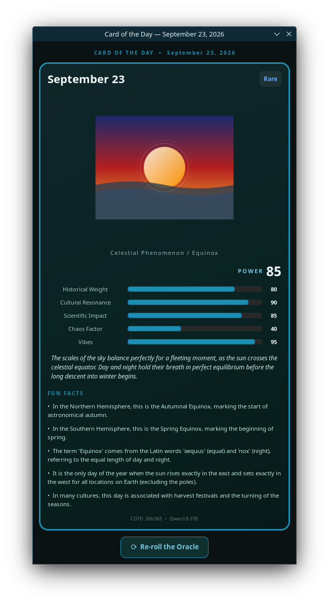

# Card of the Day — two agents, one prompt

This repository holds **two independent implementations of the same task**,
built by two different AI coding agents from the **same prompt**, then
consolidated here for comparison.

Both agents were given the identical prompt (below), pointed at the same local
model (**Qwen3.8‑27B** served by vLLM on `127.0.0.1:8000`), and asked to build
a small GTK app that mints a Pokémon/Magic‑style **trading card for today's
calendar date**. Each agent chose its own language and approach.

| | [`opencode/`](opencode/) | [`qwencode/`](qwencode/) |
|---|---|---|
| **Agent** | `opencode` | Qwen Code (`qwen-code`) |
| **Language** | C (C11) | Python 3.12 |
| **GTK binding** | C GTK4 API directly | PyGObject (`gi`) |
| **Build** | `make` → native ELF binary | Interpreted — no build step |
| **Source size** | ~970 LOC (`src/main.c`, ~37 KB) | ~680 LOC (`card_of_the_day.py`, ~23 KB) |

Despite the different languages and idioms, **both produce a near‑identical
end result**: a GTK4 window showing a trading card with model‑generated SVG
artwork, a stat block, fun facts, and flavor text for the current date.

---

## The shared prompt (verbatim)

> Build a small GTK app that uses the Qwen3.8‑27B model running right now in
> its inference paths. When the app opens it detects the current calendar day
> and recalls historical facts it knows about that day in history and whether
> the day is special in any other ways. The inference engine then builds data
> to populate a "trading card" (like a Pokemon or Magic the Gathering card)
> demonstrating the power of the day and including SVG artwork illustration,
> stats, and fun facts about the day. Record everything you do, including this
> prompt, in a README.md in the project. When you're done, open the GTK app.
> Choose any programming language you wish from Rust to Python to C++ to even
> FORTRAN.

(Preserved verbatim in [`PROMPT.md`](opencode/PROMPT.md).)

---

## The end result — same card, two codebases

Both apps render a trading card for the day from the same model. The artwork,
stats, and facts are generated by the LLM at runtime; only the *plumbing*
differs.

| `opencode/` (C) | `qwencode/` (Python) |
|---|---|
|  |  |

*Left: the C app's card. Right: the Python app's card ("Equinox Signal",
minted for 2026‑09‑23). Same model, same day, same card concept — different
language underneath.*

---

## Side‑by‑side comparison

| Aspect | `opencode/` (C) | `qwencode/` (Python) |
|---|---|---|
| **Language** | C (C11) | Python 3.12 |
| **GTK access** | C GTK4 API | PyGObject (`gi`) |
| **Build step** | `make` → native binary | none (interpreted) |
| **HTTP client** | `curl` via `g_spawn_sync` | `urllib` (stdlib) |
| **JSON parsing** | `json‑glib` | `json` (stdlib) |
| **SVG → image** | librsvg C API → `GdkTexture` | `Rsvg` (PyGObject) → cairo surface |
| **Stat bars** | `GtkLevelBar` widgets | custom Cairo‑drawn bars |
| **Async model** | `GMainLoop` + timeouts | worker `threading.Thread` + `GLib.idle_add` |
| **Fallback card** | "The Uncharted Day" | "The Unreached Day" |
| **Date override** | `COTD_DATE=YYYY‑MM‑DD` env var | uses `date.today()` |
| **Re‑roll** | "⟳ Re‑roll the Oracle" button + `COTD_AUTO_REROLL_SECONDS` debug hook | "Redraw" button |
| **Self‑instrumentation** | manual (session log) | built‑in `timing_report.json` (TTFP + token usage) |

### What's the same (the interesting part)

Both agents, working independently, converged on the **same architecture**:

1. Detect today's date.
2. POST to the local vLLM OpenAI‑compatible endpoint with a prompt that pins a
   strict JSON schema (name, rarity, 5 stats, fun facts, flavor, SVG artwork).
3. Parse the JSON, render the SVG artwork with **librsvg**, and draw a card
   frame with a stat block and fun facts.
4. Ship a **deterministic fallback card** for when the model is unreachable or
   returns unparseable output.
5. Provide a **"re‑roll"** control to draw a new card.

That convergence is the point: the *task* strongly constrains the *solution*,
so two agents in different languages land on nearly the same design.

---

## Timing

> Caveat: the two sessions ran at different times of day and were measured
> differently, so treat cross‑agent numbers as indicative, not a controlled
> benchmark.

### `opencode/` (C) — from its session log

| Event | Wall clock | Elapsed from prompt |
|---|---|---|
| Prompt received | 10:50:56 | — |
| First command (env recon) | 10:55:09 | +4 m 13 s |
| **First app launch (window up)** | 11:29:25 | **≈ 38.5 min** |
| Re‑roll crash root‑caused & fixed | ~12:22 | ≈ 1 h 31 m |

The long tail was a **use‑after‑free crash** on re‑roll (a loader widget was
destroyed when removed from its container, then re‑added). Fixed by building a
fresh loader widget per fetch; verified with 7+ clean re‑rolls.

### `qwencode/` (Python) — from `timing_report.json` + session log

| Metric | Value |
|---|---|
| Prompt → first working card (dev time) | ~15–20 min (T0 14:24 → first card ~14:38–14:44) |
| **App TTFP** (process start → card painted) | **≈ 198 s** (dominated by 2 LLM round‑trips) |
| Window presented | ~0.04 s after start |

The Python app's per‑run TTFP is dominated by the LLM, not the GUI: the window
is up in ~40 ms, but the card waits on the model.

---

## Token usage

| | `opencode/` (C) | `qwencode/` (Python) |
|---|---|---|
| **Measurement** | Estimated (shared long‑running vLLM server) | Measured per‑run (`timing_report.json`) |
| **LLM calls** | ~30 (loads + re‑rolls + dev tests) | 2 per forge (1 empty + 1 success) |
| **Tokens** | ~5×10⁴ – 1×10⁵ (project share, est.) | **7,408** per forge (459 prompt + 6,949 completion) |
| **Cost** | $0 (local Tenstorrent hardware) | $0 (local) |

The C session's numbers are an *estimate* because it ran against a shared,
long‑running vLLM instance whose cumulative counters include other traffic. The
Python session's numbers are a clean per‑forge measurement.

---

## A shared discovery: the "empty content" gotcha

Both agents independently hit the same wall: **the model returns empty
`content`** on some calls. The C agent root‑caused it and documented the fix:

> The model must be called with
> `chat_template_kwargs: {"enable_thinking": false}` — otherwise it spends its
> whole token budget on hidden reasoning and returns empty `content`. It also
> **rejects** `response_format` (a "block‑output" model), so JSON discipline is
> enforced by the prompt alone.

The Python app worked around the same symptom with a **retry** (a first empty
call triggers a second attempt) rather than disabling thinking — which is why
its TTFP shows two LLM round‑trips. *Takeaway: `enable_thinking: false` would
halve the Python app's TTFP; that's the single highest‑value fix available.*

---

## Shared environment gotchas (this box is unusual)

Both agents documented the same non‑standard environment:

- **No `gtk_run()`** in this GTK build — drive a `GMainLoop` manually (C) /
  use `Gtk.Application` (Python).
- **No `draw` signal on `GtkDrawingArea`** in this build — the C app uses
  `GtkLevelBar`; the Python app uses `set_draw_func` on a `DrawingArea`.
- **Removing a widget from its container destroys it** — never re‑parent a
  removed widget (this caused the C app's crash).
- **Screenshots are unreliable** here — `scrot`/`grim`/`import` produce
  black/empty frames under this Wayland/KWin session; `spectacle` works.
- `rsvg_handle_new_from_data()` needs an **explicit byte length**, not `-1`.

---

## Repository layout

```
.
├── README.md            ← this file (comparison)
├── opencode/            ← C implementation (agent: opencode)
│   ├── src/main.c
│   ├── Makefile
│   ├── README.md        ← full C-app docs, gotchas, bug log
│   ├── CLAUDE.md        ← session log
│   ├── PROMPT.md
│   └── screenshot.png
└── qwencode/            ← Python implementation (agent: Qwen Code)
    ├── card_of_the_day.py
    ├── README.md        ← full Python-app docs + timing/token report
    ├── PROMPT.md
    ├── timing_report.json
    ├── dev_log.jsonl
    └── card-of-the-day-20260923.png
```

## Build & run

**C (`opencode/`):**
```sh
cd opencode && make && ./card-of-the-day
```

**Python (`qwencode/`):**
```sh
cd qwencode && /usr/bin/python3 card_of_the_day.py
```

Both require the local vLLM server for `Qwen/Qwen3.8-27B` on
`127.0.0.1:8000` and the GTK4 / librsvg dev libraries.

---

## Bottom line

Two agents, one prompt, two languages — and **the same card**. The C version is
a lean native binary with a manual memory‑management footgun (the re‑roll
crash); the Python version is faster to iterate and self‑instrumenting, at the
cost of an interpreter. The end user sees essentially the same trading card
either way — which is exactly the point of an abstraction layer like GTK.
