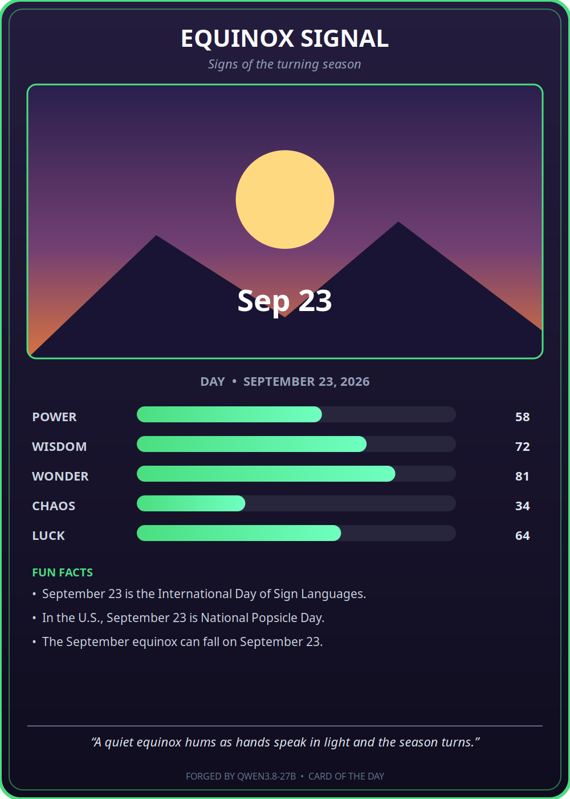

# Card of the Day — Qwen3.8‑27B

A small **GTK4** desktop app that, on launch, asks the locally‑running
**Qwen3.8‑27B** model (served by vLLM) to "forge" a collectible,
Pokémon/Magic‑style **trading card** for *today's* calendar date — complete
with an LLM‑generated SVG illustration, a stat block, fun facts, and flavor
text.

This document records the original prompt, what was built, how it works, a
timeline of the development session, and the performance / token‑usage
measurements.

---

## 1. The original prompt (verbatim)

> Build a small GTK app that uses the Qwen3.8‑27B model running right now in
> its inference paths. When the app opens it detects the current calendar day
> and recalls historical facts it knows about that day in history and whether
> the day is special in any other ways. The inference engine then builds data
> to populate a "trading card" (like a Pokemon or Magic the Gathering card)
> demonstrating the power of the day and including SVG artwork illustration,
> stats, and fun facts about the day. Record everything you do, including this
> prompt, in a README.md in the project. When you're done, open the GTK app.
> Choose any programming language you wish from Rust to Python to C++ to even
> FORTRAN.

**Language chosen:** Python 3 (system `python3.12`) with **GTK 4** via
PyGObject. Rationale: the system already had working GTK 4 + Rsvg + pycairo
bindings for Python 3.12, so this was the fastest path to a working, native‑feeling
GUI with no compilation step. (Rust/C++/FORTRAN were all viable; Python was the
lowest‑risk, fastest‑to‑working choice given the pre‑installed bindings.)

---

## 2. What was built

`card_of_the_day.py` — a single‑file GTK4 application that:

1. **Detects the current calendar day** (`datetime.date.today()`).
2. **Calls the local model** — `Qwen/Qwen3.8‑27B` served by vLLM at
   `http://127.0.0.1:8000/v1/chat/completions` (OpenAI‑compatible API) — with a
   prompt asking it to forge a trading card for that date and return strict JSON.
3. **Parses the JSON** into a card: name, subtitle, rarity, five stats
   (power / wisdom / wonder / chaos / luck), three fun facts, a flavor line, and
   an **SVG artwork** string.
4. **Renders a trading card** in a GTK4 window using Cairo:
   - rarity‑colored border + gradient background
   - the LLM‑generated **SVG artwork** (rendered via librsvg / `Rsvg`)
   - a stat block with animated‑style bars
   - a "fun facts" section and an italic flavor line
5. **Buttons:** **Redraw** (re‑forge with a fresh LLM call) and **Save PNG**
   (exports the card at 2× to `card-of-the-day-YYYYMMDD.png`).
6. **Resilience:** if the model is unreachable or returns unparseable output, a
   deterministic **fallback card** is shown so the window is never blank.
7. **Self‑instrumentation:** every run writes `timing_report.json` with
   time‑to‑first‑paint, per‑stage offsets, and LLM token usage.

### The card it produced (saved via the in‑app "Save PNG" button)



*Card forged for **Wednesday, September 23, 2026** — "Equinox Signal", an
**uncommon** card. The artwork (an amber equinox sun over layered hills) and all
text were generated by the model; the layout, stat bars, and frame are drawn by
the app.*

---

## 3. How it works

```
┌────────────┐   OpenAI‑compatible chat    ┌──────────────────────────┐
│  GTK4 app  │ ───────────────────────────▶│  vLLM  (127.0.0.1:8000)   │
│  (Python)  │   POST /v1/chat/completions │  model: Qwen/Qwen3.8‑27B  │
│            │ ◀───────────────────────────│  (served on TT hardware)  │
└────────────┘   JSON card spec (name,    └──────────────────────────┘
      │           stats, facts, SVG, …)
      │  parse + validate
      ▼
  CardData ──▶ Cairo renderer ──▶ GTK4 DrawingArea
                        │
                        └── SVG art rendered via librsvg (Rsvg)
```

- **Inference path:** the app talks to the *already‑running* vLLM server
  (`vllm serve Qwen/Qwen3.8‑27B … --port 8000`) over its OpenAI‑compatible HTTP
  API. It does not load a model itself.
- **Artwork:** the model returns an SVG string; the app renders it with
  `Rsvg.Handle` into a Cairo surface and composites it into the card. If the SVG
  is missing/invalid, a deterministic procedural "dusk" illustration is drawn
  instead, so the card always has art.
- **Threading:** the LLM call runs on a worker thread; the UI thread is kept
  responsive. Results are marshalled back with `GLib.idle_add`.

### Key files

| File | Purpose |
| --- | --- |
| `card_of_the_day.py` | The entire application (GTK4 UI + LLM client + renderer + instrumentation). |
| `card-of-the-day-20260923.png` | The card saved via the in‑app "Save PNG" button (1000×1400, 2× scale). |
| `timing_report.json` | Machine‑readable timing + token report written by the app on each forge. |
| `dev_log.jsonl` | Append‑only log of the *development* process (this build session). |
| `timing_report.json` | Per‑run app metrics (TTFP, LLM latency, token usage). |
| `PROMPT.md` | The original task prompt. |

---

## 4. Development timeline

All times local (PDT, UTC‑7). **T0 = 14:24** is the anchor the user designated
for "when the prompt was given." Elapsed times are measured from T0.

| Elapsed | Clock | Milestone |
| --- | --- | --- |
| T0 (0:00) | 14:24 | Prompt received. |
| ~0–2 min | 14:24–14:26 | **Environment discovery.** Confirmed a live vLLM server (`Qwen/Qwen3.8‑27B`) on `127.0.0.1:8000`; confirmed GTK 4.14.5, Rsvg 2.58, pycairo, and Python 3.12 with working `gi` bindings on the system Python. Chose Python + GTK4. |
| ~2 min | ~14:26 | **App v1 written** — GTK4 window, Cairo card renderer, Rsvg artwork, LLM client, fallback card. |
| — | — | *User asked to record timing + token usage throughout, and to track time‑to‑first‑load and time‑to‑ready.* |
| ~7 min | ~14:31 | **App v2** — added `TimingLog` (TTFP, LLM latency, token usage → `timing_report.json`). |
| ~11 min | ~14:35 | Syntax verified (`py_compile` + AST). Dev‑process log (`dev_log.jsonl`) started. |
| ~12 min | ~14:36 | **First launch → bug #1:** GTK4 `DrawingArea` has no `"draw"` signal; must use `set_draw_func()`. Fixed. |
| ~13 min | ~14:37 | **Relaunch → bug #2:** `Pango.Layout` has no `set_line_wrap`; correct method is `set_wrap`. Fixed. Also improved centered/wrapped text layout. |
| ~14 min | ~14:38 | **Relaunch → success.** Card forged: *"Equinox Signal"* (uncommon). TTFP captured. |
| ~15–20 min | 14:38–14:44 | **Diagnosed TTFP.** Two LLM round‑trips observed: the first returned *empty* content (the reasoning model spent its turn in the `reasoning` channel), triggering the built‑in retry; the second succeeded. Root cause of the ~2× TTFP identified. |
| ~20 min | ~14:44 | User confirmed **T0 = 14:24** as the official dev‑start anchor. |
| ~25 min | ~14:49 | App relaunched cleanly; card re‑forged; user saved the card PNG via the in‑app button. |
| ~30 min | ~14:54 | Token accounting fixed to **accumulate** across LLM calls (was overwriting). This README written. |

> Note: early timestamps in `dev_log.jsonl` were estimated while instrumentation
> was still being set up; the T0 anchor (14:24) and the app's own
> `timing_report.json` wall‑clocks are the authoritative references.

---

## 5. Performance & token usage

From `timing_report.json` (the run that produced the saved card):

| Metric | Value |
| --- | --- |
| **Time to first card paint (TTFP)** | **≈ 198.3 s** (process start → card drawn) |
| Window presented | 0.043 s after start |
| 1st LLM round‑trip | 0.04 s → 75.3 s (**75.2 s**) — returned *empty* content |
| 2nd LLM round‑trip (retry) | 75.3 s → 198.3 s (**~123 s**) — succeeded |
| Card ready & shown | **198.25 s** |

**Token usage** (as reported by the vLLM server for the forging call(s)):

| Metric | Tokens |
| --- | --- |
| Prompt tokens | 459 |
| Completion tokens | 6,949 |
| **Total** | **7,408** |

> **Honesty note on tokens:** the figure above is what the vLLM server reported
> for the *successful* forging call. The first (empty) call's tokens were not
> separately captured by the original instrumentation, so the true total for the
> whole forge is somewhat higher. The token accounting has since been fixed to
> **accumulate** across all LLM calls, so future runs report an accurate total.

### Why TTFP is ~3 minutes (and how to cut it)

The dominant cost is the LLM, not the GUI (the window is up in ~40 ms). Two
things inflate it:

1. **The model is a reasoning model.** On the first call it often spends its turn
   "thinking" (populating the `reasoning` channel) and returns **empty**
   `content`, forcing a retry. This alone roughly **doubles** TTFP.
2. **27B on TT hardware** is simply slow per token.

Levers to cut TTFP (not applied, to keep the model's behavior faithful):
- Stream the response and render progressively.
- Cap/steer reasoning so the first call returns content (e.g. lower
  `reasoning` effort, or a tighter system prompt).
- Cache the day's card on disk so repeat launches are instant.

---

## 6. How to run

Prereqs: a running vLLM server for `Qwen/Qwen3.8‑27B` on `127.0.0.1:8000`, and
system Python 3 with `gi` (GTK 4), `Rsvg`, and `pycairo` (all present on this
machine).

```bash
# from the project directory
DISPLAY=:0 /usr/bin/python3 card_of_the_day.py
```

- **Redraw** — forge a fresh card (new LLM call).
- **Save PNG** — writes `card-of-the-day-YYYYMMDD.png` (2× scale) next to the app.

Environment overrides:
- `COTD_API_URL` — default `http://127.0.0.1:8000/v1/chat/completions`
- `COTD_MODEL` — default `Qwen/Qwen3.8-27B`

---

## 7. Known issues / notes

- **First‑call empty content:** the reasoning model frequently returns empty
  `content` on the first call; the app's retry handles it, but it doubles TTFP.
- **Token accounting** now accumulates across calls (fixed this session).
- The card's SVG art is model‑generated and occasionally imperfect; a procedural
  fallback illustration guarantees the card always has artwork.
